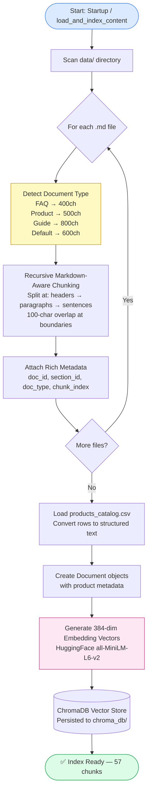
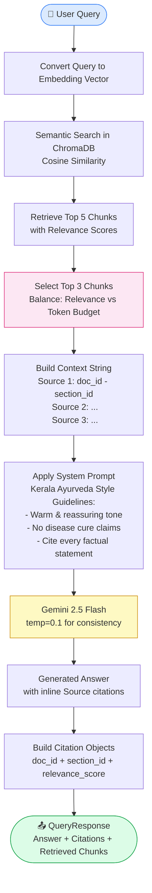
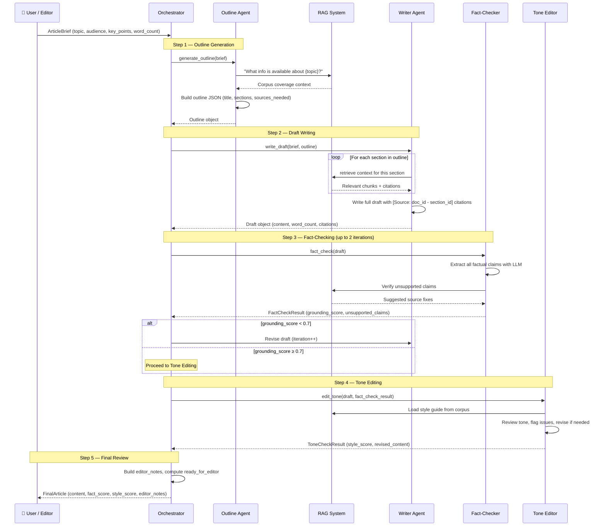
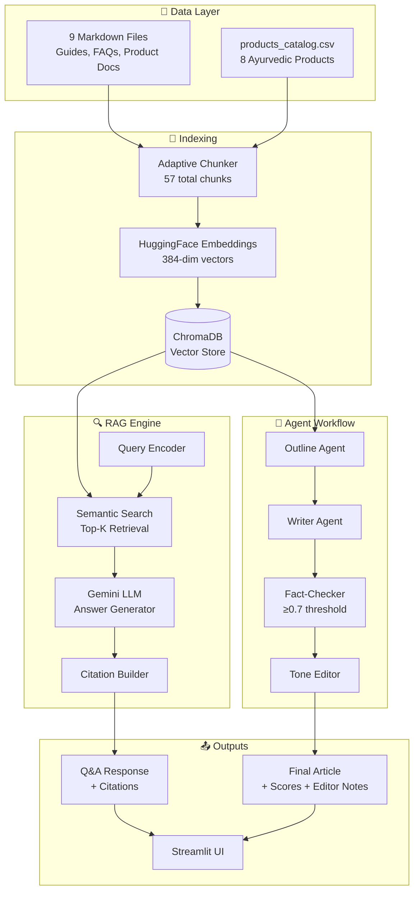
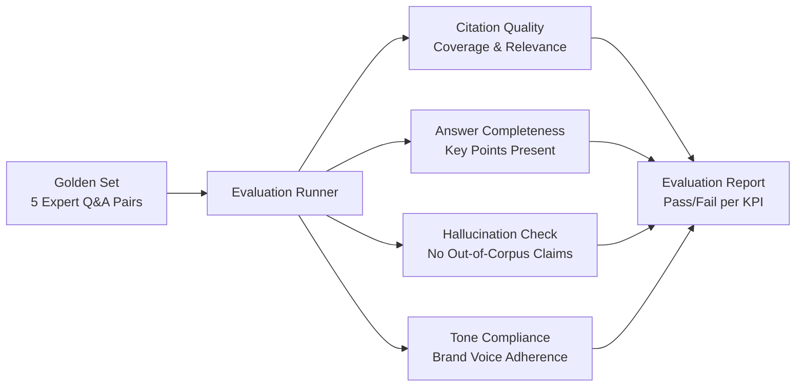

# Kerala Ayurveda — Agentic AI System
## BTP System Architecture & Workflow Documentation

**Project Title:** RAG System with Agentic AI Workflow for Kerala Ayurveda
**Date:** February 23, 2026

---

## 1. Executive Summary

This project builds a **production-ready AI content system** for Kerala Ayurveda, a wellness brand. It has two tightly integrated components:

| Component | Description |
|-----------|-------------|
| **Part A — RAG Q&A System** | Answers user questions about Ayurveda using retrieved, cited knowledge from a curated document corpus |
| **Part B — Multi-Agent Workflow** | Generates complete, fact-checked, brand-compliant wellness articles using a pipeline of specialized AI agents |

The system prevents AI hallucination through grounding guardrails, enforces medical safety disclaimers automatically, and produces traceable, citation-backed outputs.

---

## 2. High-Level System Architecture

```
┌──────────────────────────────────────────────────────────────────────────┐
│                    KERALA AYURVEDA AGENTIC AI SYSTEM                     │
├──────────────────────────────────────────────────────────────────────────┤
│                                                                          │
│   ┌─────────────────────────────────────────────────────────────────┐   │
│   │  📁  DATA LAYER  (data/)                                        │   │
│   │                                                                 │   │
│   │  9 Markdown Files (Guides, FAQs, Product Docs)                 │   │
│   │  1 CSV Product Catalog  (8 Products)                           │   │
│   │  ──────────────────────────────────────                        │   │
│   │  Total: ~57 indexed knowledge chunks                            │   │
│   └──────────────────────┬──────────────────────────────────────────┘   │
│                           │  load & index                                │
│                           ▼                                              │
│   ┌─────────────────────────────────────────────────────────────────┐   │
│   │  🔍  PART A — RAG SYSTEM  (src/rag_system.py)                  │   │
│   │                                                                 │   │
│   │  ┌─────────────┐   ┌──────────────┐   ┌─────────────────────┐ │   │
│   │  │  Adaptive   │──▶│  ChromaDB    │──▶│   Gemini LLM +      │ │   │
│   │  │  Chunking   │   │  Vector Store│   │   Citation Builder  │ │   │
│   │  │ (400–800ch) │   │  (Semantic   │   │   (QueryResponse)   │ │   │
│   │  └─────────────┘   │  Retrieval)  │   └─────────────────────┘ │   │
│   │                     └──────────────┘                            │   │
│   └──────────────────────────┬──────────────────────────────────────┘   │
│                               │  powers all agents                       │
│                               ▼                                          │
│   ┌─────────────────────────────────────────────────────────────────┐   │
│   │  🤖  PART B — MULTI-AGENT WORKFLOW  (src/agent_workflow.py)    │   │
│   │                                                                 │   │
│   │  ArticleBrief ──▶ Outline ──▶ Writer ──▶ FactCheck ──▶ Tone   │   │
│   │                   Agent     Agent      Agent        Editor     │   │
│   │                                        (≥0.7 gate)            │   │
│   └──────────────────────────┬──────────────────────────────────────┘   │
│                               │  final article                           │
│                               ▼                                          │
│   ┌─────────────────────────────────────────────────────────────────┐   │
│   │  🌐  STREAMLIT WEB UI  (streamlit_app.py)                      │   │
│   │  User enters query → sees answer + traceable citations          │   │
│   └─────────────────────────────────────────────────────────────────┘   │
└──────────────────────────────────────────────────────────────────────────┘
```

---

## 3. Technology Stack

| Layer | Technology | Purpose |
|-------|-----------|---------|
| LLM | Google Gemini 2.5 Flash | Text generation, reasoning |
| Embeddings | HuggingFace `all-MiniLM-L6-v2` | Semantic vector creation (local, no API) |
| Vector DB | ChromaDB | Storing & retrieving document embeddings |
| Orchestration | LangChain | Prompt templates, chains, document splitting |
| Frontend | Streamlit | Interactive web UI |
| Runtime | Python 3.11 | Core implementation |
| Containerization | Docker + Docker Compose | Deployment |

---

## 4. Part A — RAG System Workflow

### 4.1 Indexing Pipeline (Run Once at Startup)



### 4.2 Query → Answer Pipeline (Real-Time)



### 4.3 Adaptive Chunking Logic

| Document Type | Chunk Size | Overlap | Why |
|---------------|------------|---------|-----|
| FAQ (`faq_*.md`) | 400 chars | 100 ch | Keeps Q&A pairs intact |
| Product (`product_*.md`) | 500 chars | 100 ch | Preserves structured sections |
| Guide (`*guide*.md`, `dosha*.md`) | 800 chars | 100 ch | Conceptual content needs more context |
| Default (other) | 600 chars | 100 ch | Balanced default |

---

## 5. Part B — Multi-Agent Workflow

### 5.1 Agent Pipeline Overview

```mermaid
flowchart LR
    B([📋 Article Brief\nTopic + Audience\n+ Key Points]) --> OA

    OA["🧭 Agent 1\nOutline Agent\nVerifies corpus coverage\nGenerates structured outline"]
    WA["✍️ Agent 2\nWriter Agent\nPer-section RAG retrieval\nWrites draft with citations"]
    FC["🔍 Agent 3\nFact-Checker Agent\nExtracts all claims\nScores grounding 0-1"]
    TE["🎨 Agent 4\nTone Editor Agent\nLoads brand style guide\nEdits voice only"]
    FR["✅ Final Review\nOrchestrator\nEditor Notes + Score"]

    OA -->|Outline| WA
    WA -->|Draft| FC
    FC -->|grounding ≥ 0.7?| GATE{Pass?}
    GATE -- No, retry up to 2x --> WA
    GATE -- Yes --> TE
    TE -->|Revised Draft| FR
    FR --> OUT([📄 FinalArticle\nContent + Citations\nFact Score + Style Score])

    style B fill:#dbeafe,stroke:#3b82f6
    style OUT fill:#dcfce7,stroke:#16a34a
    style FC fill:#fef9c3,stroke:#ca8a04
    style GATE fill:#fce7f3,stroke:#db2777
```



### 5.2 Detailed Step-by-Step Workflow



### 5.3 Agent Responsibilities & Guardrails

| Agent | Input | Output | Key Guardrail |
|-------|-------|--------|---------------|
| **Outline Agent** | ArticleBrief | Outline (JSON) | Queries corpus *before* creating sections — no unsupported topics |
| **Writer Agent** | Outline + Brief | Draft with citations | Per-section RAG retrieval — one source per claim enforced in prompt |
| **Fact-Checker Agent** | Draft | FactCheckResult | Auto-reject if `grounding_score < 0.7` — retry up to 2 times |
| **Tone Editor Agent** | Draft + FactCheck | Revised Draft | Preserves all citations & safety disclaimers — edits voice only |
| **Orchestrator** | ArticleBrief | FinalArticle | Gates `ready_for_editor` behind all quality thresholds |

---

## 6. Data Flow Diagram



---

## 7. Key Performance Indicators (KPIs)

### 7.1 RAG System KPIs

| KPI | Target | Description & Measurement |
|-----|--------|--------------------------|
| **Retrieval Precision** | ≥ 80% | % of retrieved chunks relevant to the query. Measured via golden set evaluation with human-labelled relevance. |
| **Citation Coverage** | 100% | Every answer must include at least one `[Source X]` citation pointing to a traceable `doc_id + section_id`. |
| **Average Relevance Score** | ≥ 0.75 | Mean cosine similarity score of top-3 retrieved chunks across test queries (ChromaDB relevance score). |
| **Hallucination Rate** | < 5% | % of answers containing claims **not** present in the retrieved context. Verified by Fact-Checker agent. |
| **Query Latency** | < 5s | End-to-end time from user query submission to answer display in Streamlit UI. |
| **Knowledge Coverage** | ≥ 90% | % of golden-set benchmark questions answerable from the corpus without fallback messages. |

### 7.2 Multi-Agent Workflow KPIs

| KPI | Target | Description & Measurement |
|-----|--------|--------------------------|
| **Grounding Score** | ≥ 0.70 (gate), ≥ 0.85 (target) | % of factual claims in the article that have a verifiable source citation. Auto-computed by Fact-Checker Agent. |
| **Style Compliance Score** | ≥ 0.85 | Adherence to Kerala Ayurveda brand voice guidelines. Scored 0–1 by Tone Editor Agent. |
| **Ready-for-Editor Rate** | ≥ 90% of articles | % of generated articles that pass all quality gates (`grounding ≥ 0.7`, `style ≥ 0.7`, citations present). |
| **Revision Iterations** | ≤ 2 per article | Number of fact-check → revise cycles before article passes grounding threshold. |
| **Article Word Count Accuracy** | ±10% of target | Generated article word count vs. `word_count_target` specified in the brief. |
| **Unsupported Claims** | 0 severity-1 claims | Any claim about diagnosis, treatment, or cure without a citation is a severity-1 failure. |
| **End-to-End Generation Time** | < 120s | Time from submitting `ArticleBrief` to receiving `FinalArticle`. Logged in `workflow_metadata`. |

### 7.3 System-Level KPIs

| KPI | Target | Measurement |
|-----|--------|-------------|
| **Uptime** | ≥ 99% | Streamlit app availability on deployment platform (Railway/Render) |
| **Index Build Time** | < 30s | Time to load 57 chunks and build ChromaDB index at startup |
| **Golden Set Pass Rate** | ≥ 80% | % of 5 benchmark Q&A pairs passing all evaluation metrics |

---

## 8. Evaluation Framework

The system includes a dedicated `src/evaluation.py` module that tests quality using a **golden set** of 5 hand-crafted benchmark question–answer pairs.



---

## 9. Project File Structure

```
Assignement Agentic AI/
│
├── src/
│   ├── rag_system.py          # Part A: RAG engine, chunking, retrieval, generation
│   ├── agent_workflow.py      # Part B: 4 agents + orchestrator
│   ├── evaluation.py          # Golden set evaluation & metrics
│   └── demo_examples.py       # Example usage scripts
│
├── data/                      # Knowledge corpus
│   ├── ayurveda_foundations.md
│   ├── dosha_guide_vata_pitta_kapha.md
│   ├── faq_general_ayurveda_patients.md
│   ├── product_ashwagandha_tablets_internal.md
│   ├── product_brahmi_tailam_internal.md
│   ├── product_triphala_capsules_internal.md
│   ├── treatment_stress_support_program.md
│   ├── content_style_and_tone_guide.md  ← Style guide used by Tone Editor Agent
│   └── products_catalog.csv
│
├── chroma_db/                 # Persisted vector index
├── streamlit_app.py           # Web UI
├── requirements.txt
├── Dockerfile
└── docker-compose.yml
```

---

## 10. Key Design Decisions

| Decision | Rationale |
|----------|-----------|
| **Local HuggingFace embeddings** (not OpenAI) | No API dependency for embeddings — faster, more reliable, zero cost at inference |
| **Adaptive chunking** (not fixed-size) | FAQ pairs, product docs, and guides have structurally different information density |
| **Top-5 retrieve, Top-3 generate** | Wider retrieval net; fewer chunks in prompt reduces context noise |
| **Temperature 0.1 for RAG, 0 for Fact-Checker** | Medical content demands consistency, not creativity; fact-checking must be deterministic |
| **0.7 grounding threshold as hard gate** | Industry standard for medical AI; below 0.7 means >30% claims unverifiable — unacceptable |
| **Per-section RAG retrieval in Writer Agent** | Ensures every section of the article is grounded in relevant context, not just the intro |
| **Style guide loaded from corpus** | Tone Editor uses the same content pipeline as all other agents — consistent architecture |

---

*Document prepared for BTP Meeting — February 23, 2026*
*System: Kerala Ayurveda Agentic AI | Domain: Healthcare & Wellness*
